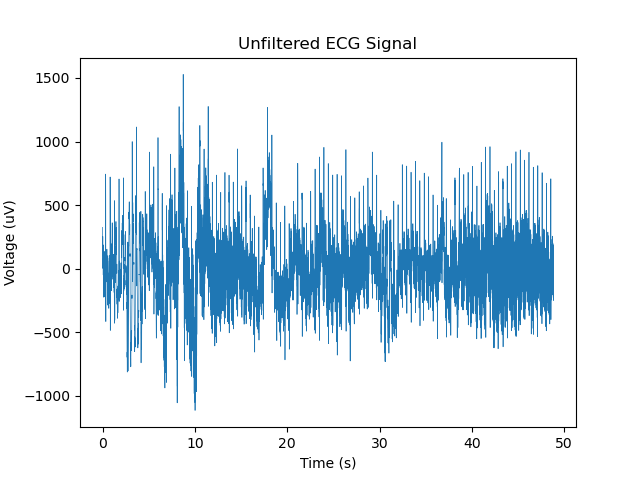
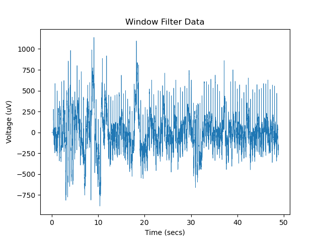
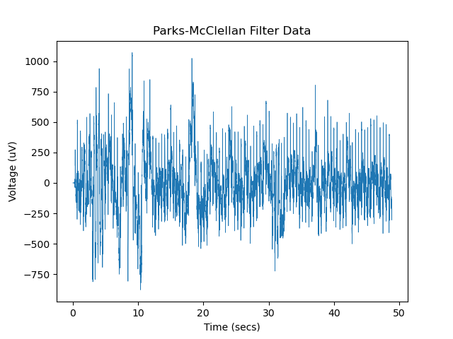

# ENEL420 - FIR & IIR Filters for ECG Singals
## Notch Filter Design for ECG Signal
Filtering of an unfiltered ECG signal with noise using FIR and IIR filters. The FIR filter is written in python and IIR filter is written in MATLAB.

### Unifiltered ECG signal

### ECG signal using FIR filter
#### ECG signal filtered using window function

#### ECG signal filtered using Parks-McClellan

#### Realisation Diagram of IIR Filter

## Contributors
* [Hassan Alhujhoj](https://eng-git.canterbury.ac.nz/haa61)
* [Luke Trenberth](https://eng-git.canterbury.ac.nz/ltr28)

